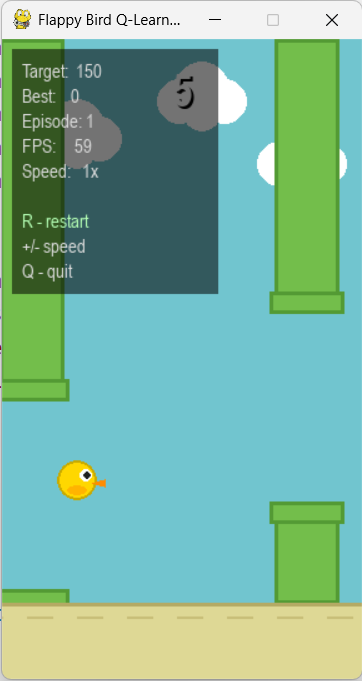

# 🐦 Flappy Bird Q-Learning Agent


An AI agent that learns to play Flappy Bird from scratch using **Tabular Q-Learning**. No rules are given — the agent discovers when to flap purely through trial and error over thousands of game episodes.

---



---

## How It Works

The game is modelled as a **Markov Decision Process (MDP)**. At every frame the agent sees three values:

| State | Description |
|---|---|
| `dx` | Horizontal distance to the next pipe |
| `dy` | Vertical distance from the bird to the gap center |
| `vy` | Bird's current vertical velocity |

It picks one of two actions — **flap** or **do nothing** — and receives:

| Event | Reward |
|---|---|
| Surviving one frame | `+1` |
| Passing a pipe | `+5` |
| Collision | `-100` |

The agent updates its Q-table after every action using:

```
Q(s,a) ← Q(s,a) + α [r + γ max Q(s',a') − Q(s,a)]
```

| Parameter | Value |
|---|---|
| Learning rate α | 0.1 |
| Discount factor γ | 0.99 |
| Training episodes | 8,000 |
| Initial epsilon | 1.0 |
| Min epsilon | 0.01 |
| Epsilon decay | 0.0005 |

---

## Results

| Configuration | Pipe Speed | Mean Score | Max Score |
|---|---|---|---|
| Baseline | 4 px/frame | 1010.77 | 7579 |
| Fast Pipes | 6 px/frame | 30.54 | 238 |

Faster pipes give the agent less time to react, causing a large drop in performance.

---

## Installation

```bash
git clone https://github.com/YOUR_USERNAME/flappy-bird-qlearning.git
cd flappy-bird-qlearning/flappy_rl
pip install numpy matplotlib pygame
```

---

## Run

```bash
# Watch the trained AI play
python src/play_visual.py

# Watch the Fast Pipes agent
python src/play_visual.py --config fast_pipes

# Play yourself
python src/play_visual.py --human

# Continue learning while playing
python src/play_visual.py --learn

# Retrain from scratch
python src/train.py

# Generate result plots
python src/analyze.py
```

**Controls:**

| Key | Action |
|---|---|
| `SPACE` / click | Flap (human mode) |
| `↑` / `↓` | Speed up / slow down |
| `R` | Restart episode |
| `Q` / `ESC` | Quit |

---

## Project Structure

```
flappy_rl/
├── src/
│   ├── flappy_env.py       # Game environment (MDP)
│   ├── agent.py            # Q-Learning agent
│   ├── train.py            # Training script
│   ├── analyze.py          # Result plots
│   └── play_visual.py      # Visual demo (Pygame)
├── models/                 # Saved Q-tables (.pkl)
├── results/                # Training metrics and plots
└── FlappyBird_QLearning.ipynb
```

---

## Team

**Team 5 — CSCI3613 Artificial Intelligence, ADA University, Spring 2026**

| Name | Student ID |
|---|---|
| Kamal Hasanov | 15271 |
| Farid Gambarli | 19605 |
| Maisa Babayeva | 18079 |